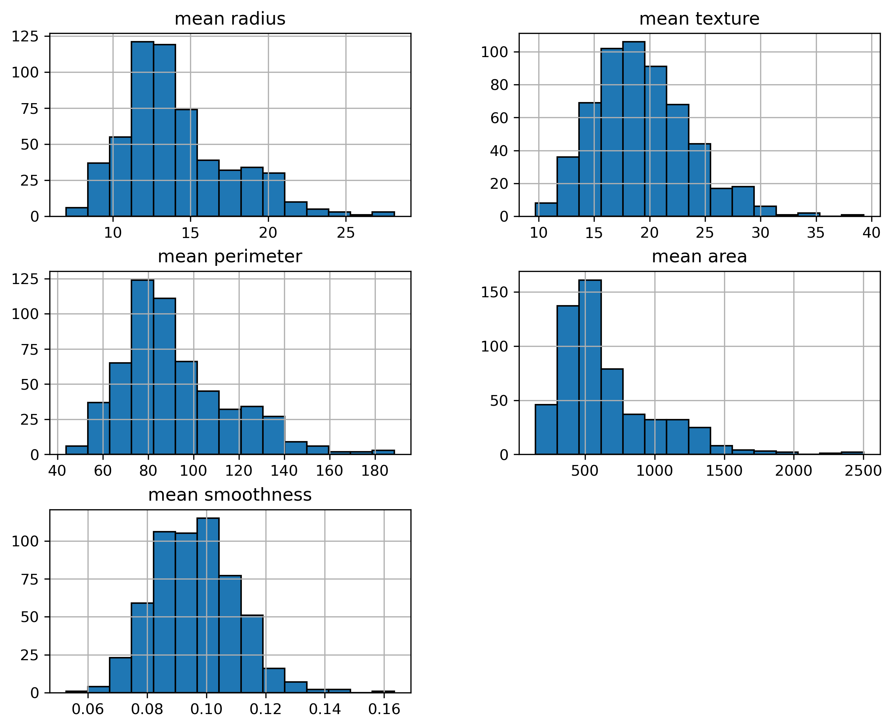
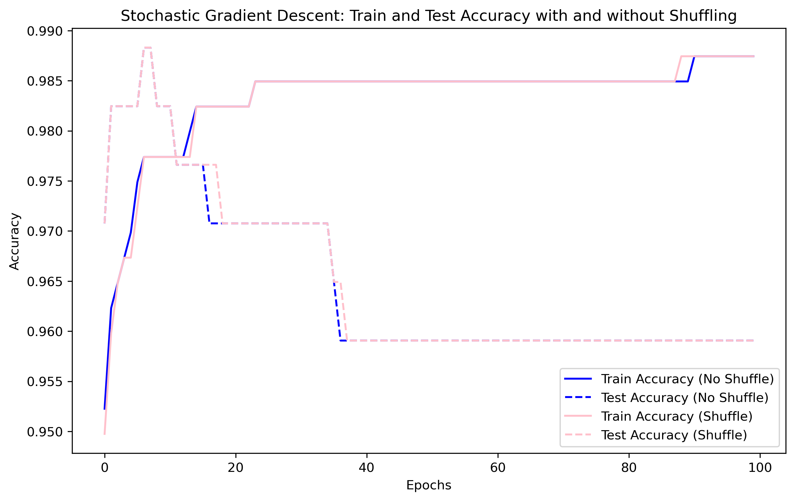
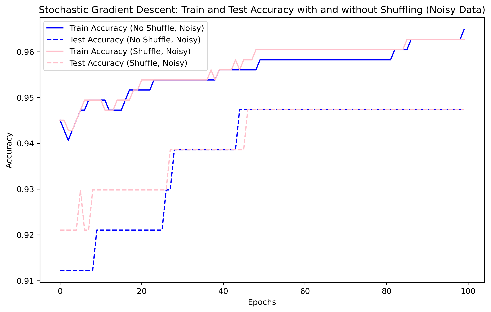
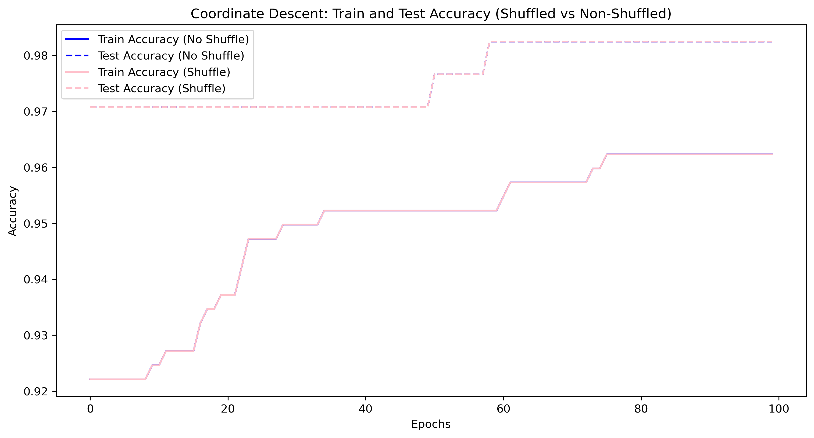
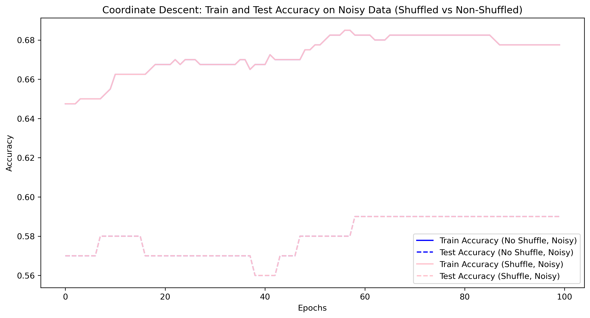
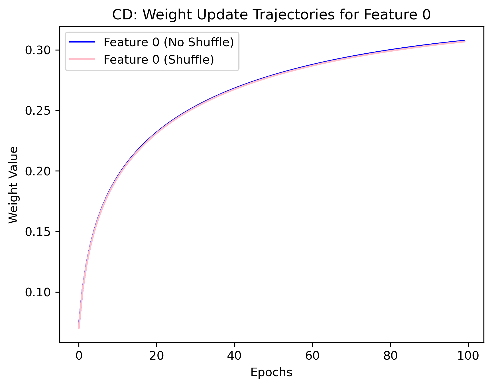
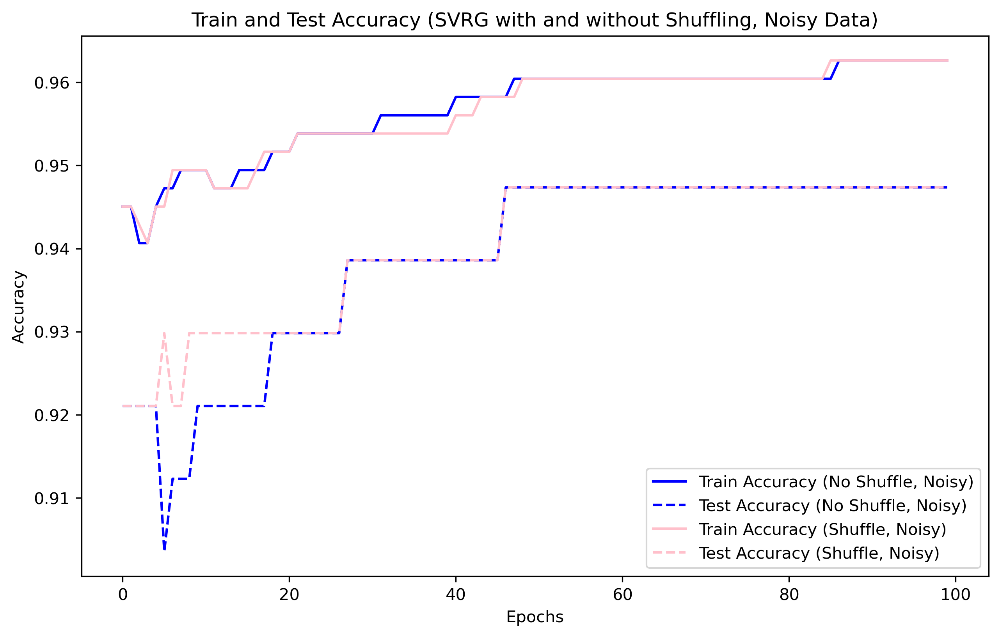
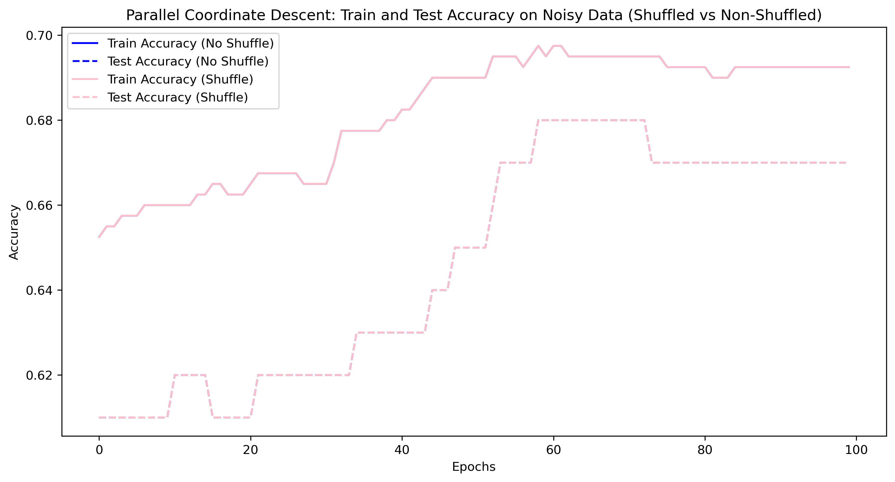

# DSC210-final-project-topic10-SGD-CD

## Topic: Randomization on Stochastic Gradient Descent (SGD) and Coordinate Descent (CD)

### 1. Instruction:

Ensure that the following libraries are installed in the enviroment.
- **scikit-learn**
- **matplotlib**
- **numpy**
- **pandas**

Open 210_final_project.ipynb and run all the cells of the notebook.

### 2. Results:

#### EDA
The distribution of features:

#### NLA
* SDG

* CD

* CD Weight Update Trajectories

#### SOTA
* SVRG

* PCD

  
